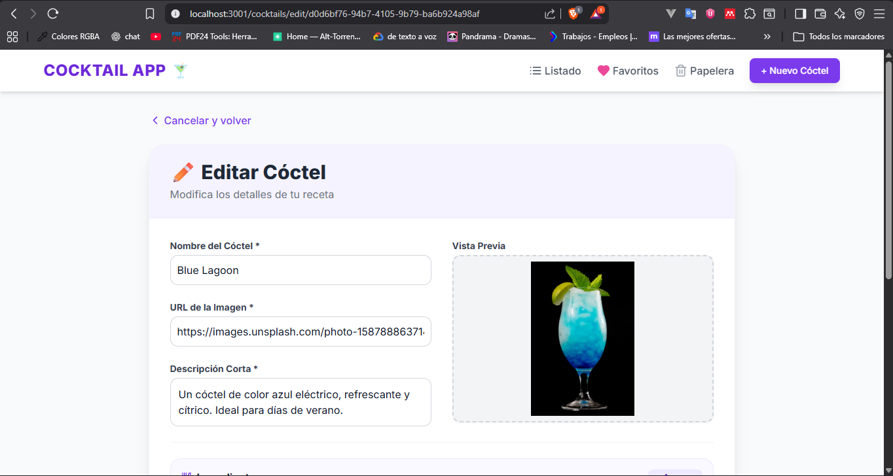
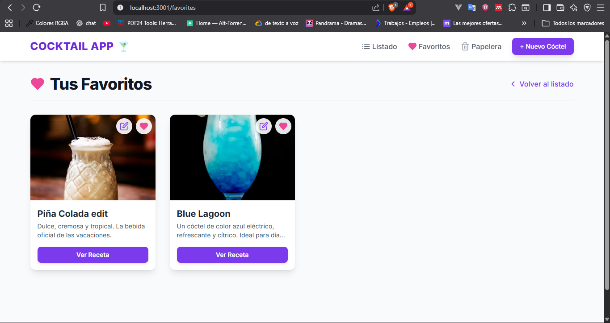
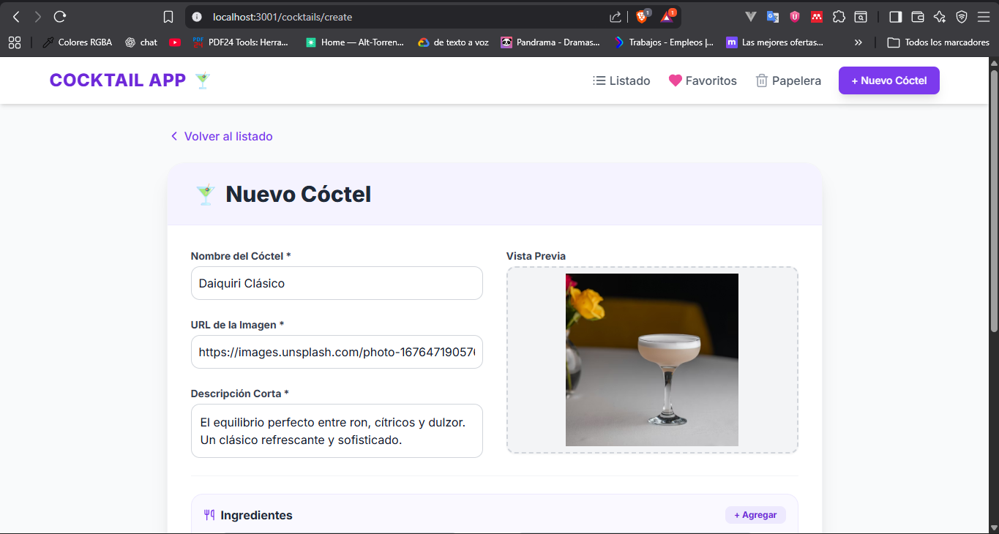
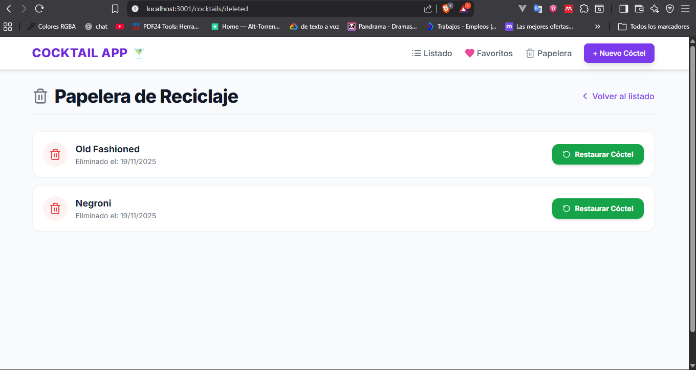

# Prueba Técnica - Aplicación de Cócteles (Fullstack)

🍹 **Cocktail App**

Este repositorio contiene la solución a la prueba técnica para el puesto de Desarrollador Fullstack. El proyecto es una aplicación web para gestionar un catálogo de cócteles, permitiendo operaciones de lectura, creación, edición y eliminado lógico.

---

## 🏗️ Estructura del Repositorio

El proyecto está estructurado como un **Monorepo** dividido en dos directorios principales:

### 🟢 **Backend** (`/backend`)

API RESTful construida con **Node.js**, **Express** y **TypeScript**. Utiliza **PostgreSQL** como base de datos y **TypeORM** para el mapeo objeto-relacional.

📄 [Ver instrucciones del Backend](./backend/README.md)

### 🔵 **Frontend** (`/frontend`)

Aplicación web construida con **React**, **Next.js** y **Tailwind CSS**. Interfaz moderna y responsive para consumir la API del Backend.

📄 [Ver instrucciones del Frontend](./frontend/README.md)

---

## ⚙️ Tecnologías Utilizadas

### Backend
- **Lenguaje:** TypeScript
- **Framework:** Node.js + Express 5
- **ORM:** TypeORM
- **Base de Datos:** PostgreSQL
- **Testing:** Jest + Supertest
- **Arquitectura:** Capas (Controller-Service-Repository)

### Frontend
- **Lenguaje:** TypeScript
- **Framework:** React + Next.js 14 (App Router)
- **Estilos:** Tailwind CSS
- **State Management:** Custom Hooks (useCocktails, useFavorites)
- **HTTP Client:** Axios

---

## 📦 Instrucciones Generales

Para ejecutar el proyecto localmente, es necesario levantar ambos servicios (Backend y Frontend) de manera independiente siguiendo las instrucciones detalladas en el `README.md` de cada carpeta correspondiente.

### Orden de Ejecución Recomendado:

1. **Iniciar el Backend:**
   ```bash
   cd backend
   npm install
   npm run dev
   ```
   El servidor estará disponible en `http://localhost:3000`

2. **Iniciar el Frontend:**
   ```bash
   cd frontend
   npm install
   npm run dev
   ```
   La aplicación estará disponible en `http://localhost:3001`

> **💡 Recomendación:** Las URLs de las imágenes de los cócteles se pueden obtener de [Unsplash](https://unsplash.com/es). Buscar el cóctel deseado y copiar la dirección de la imagen para usarla en el formulario de creación/edición.

---

## 📸 Capturas del Sistema

### Vista Principal - Listado de Cócteles


### Detalle de Cóctel


### Formulario - Editar Cóctel



### Vista de Favoritos



### Crear Nuevo Cóctel



### Gestión - Papelera



### Demostración Completa (GIF)


---

## 🚀 Características Implementadas

### Backend
- ✅ CRUD completo de cócteles
- ✅ Soft Delete (eliminado lógico)
- ✅ Paginación y filtros
- ✅ Validaciones de negocio
- ✅ Arquitectura por capas
- ✅ Tests automatizados
- ✅ UUIDs para seguridad

### Frontend
- ✅ Interfaz responsive (Mobile-First)
- ✅ CRUD visual con modales
- ✅ Sistema de favoritos (localStorage)
- ✅ Búsqueda y filtros
- ✅ Gestión de estados con hooks
- ✅ Integración completa con API

---

## 🐳 Despliegue con Docker

El proyecto está preparado para ser contenerizado. Con los builds de producción (`npm run build`) y la configuración adecuada de las variables de entorno, se pueden crear los `Dockerfile` correspondientes para cada servicio y orquestarlos mediante `docker-compose.yml` para un despliegue simplificado.

---

## 👨‍💻 Autor

**Willan Alexander Díaz Cordova** 🦖

---

## 📄 Licencia

Este proyecto fue desarrollado como parte de una prueba técnica.